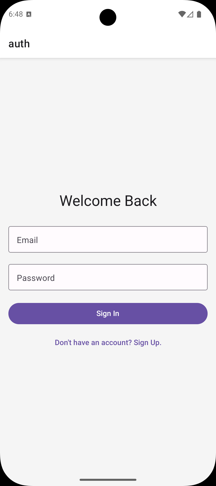
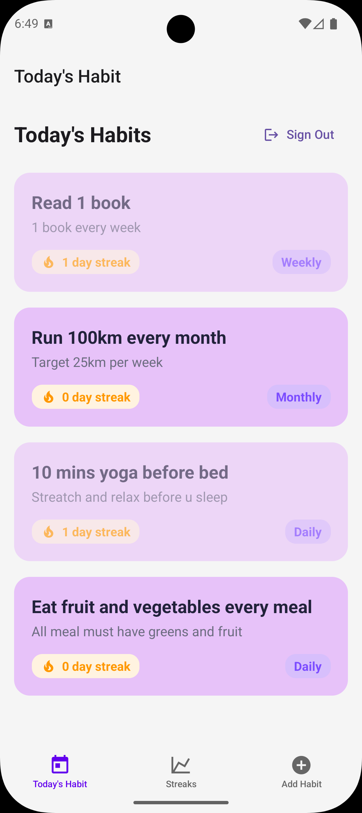
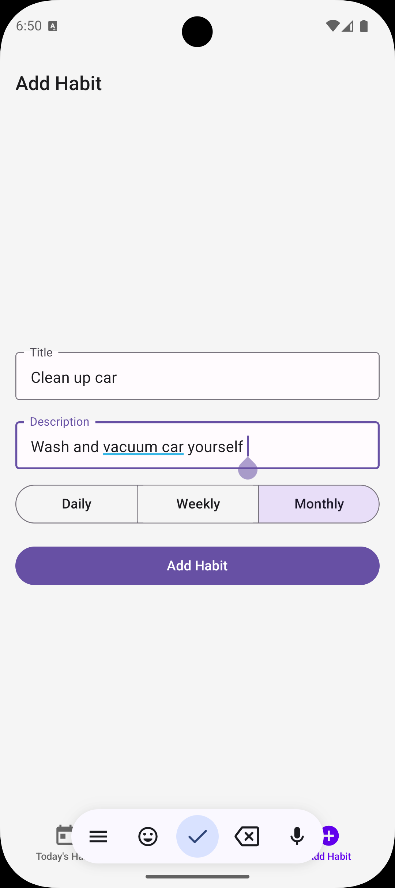
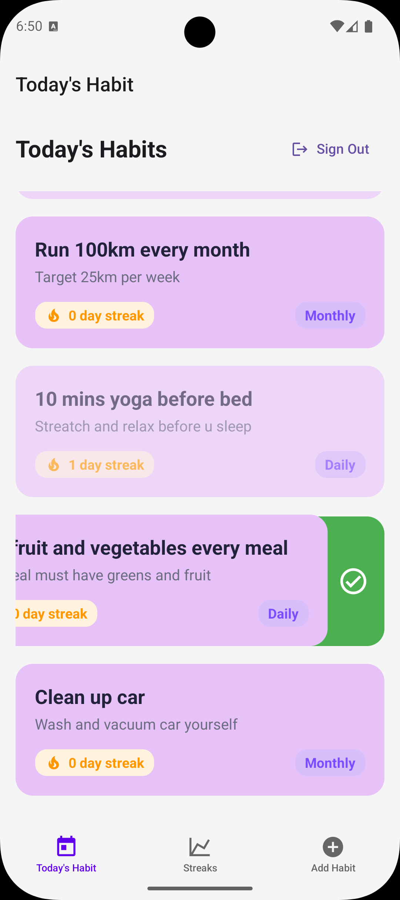
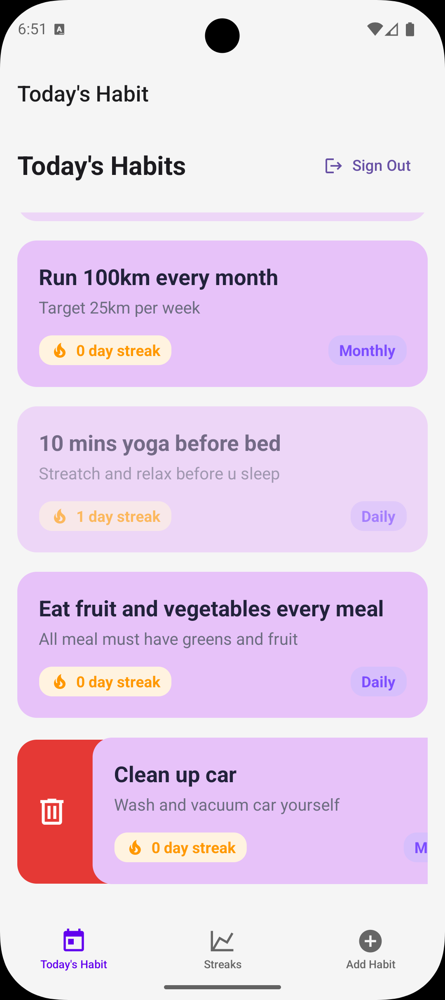

# 📅 Habit Tracker App

A simple and intuitive **Habit Tracker mobile application** built using **React Native**, **Expo** and **Appwrite**.

This app allows users to track daily progress, visualizes streaks and compete on habit streak rankings.

---

## 🚀 Features

- 🔐 User authentication (Sign-up and login using email)
- ➕ Create new habits
- 👈 Swipe left to complete a habit
- 👉 Swipe right to delete a habit
- 🔥 Habit streak tracking
- 🏆 Streak ranking leaderboard
- ☁️ Backend powered by Appwrite

---

## 🔨 Tech Stack

- **Frontend**: React Native (Expo)
- **Backend**: Appwrite
- **Authentication**: Appwrite Auth
- **Database**: Appwrite Database
- **Gesture Handling**: React Native Gesture Handler
- **Deployment**: Expo

---

## 📸 Screenshots

<table>
  <tr>
    <th>Login</th>
    <th>Habit List</th>
    <th>Streak Ranking</th>
    <th>Create Habit</th>
    <th>Complete Habit</th>
    <th>Delete Habit</th>
  </tr>
  <tr>
    <td></td>
    <td></td>
    <td></td>
    <td></td>
    <td></td>
    <td></td>
  </tr>
</table>
---

## 🎥 Demo Video

[▶️ Watch Habit Tracker App Demo Video](assets\videos\habit-tracker-app-demo-video.mp4)

> GitHub does not auto-play videos, but clicking the link will download or play it.

---
## 🚀 Live deployment on Expo
[Coming soon](#insert link later)

